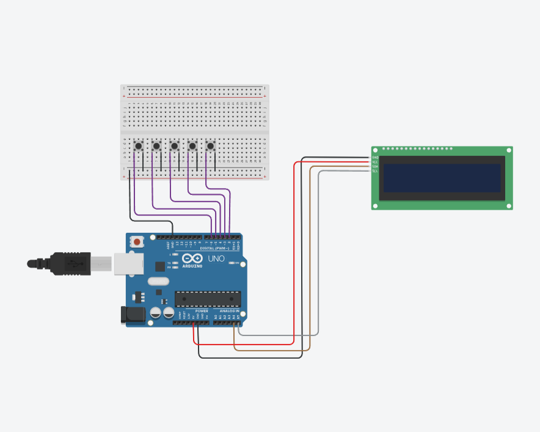
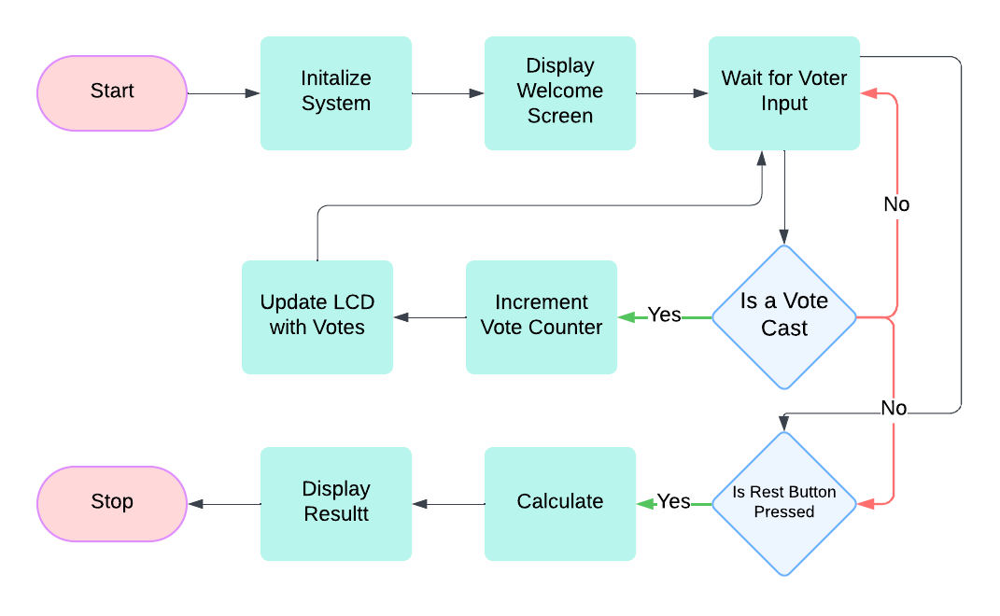
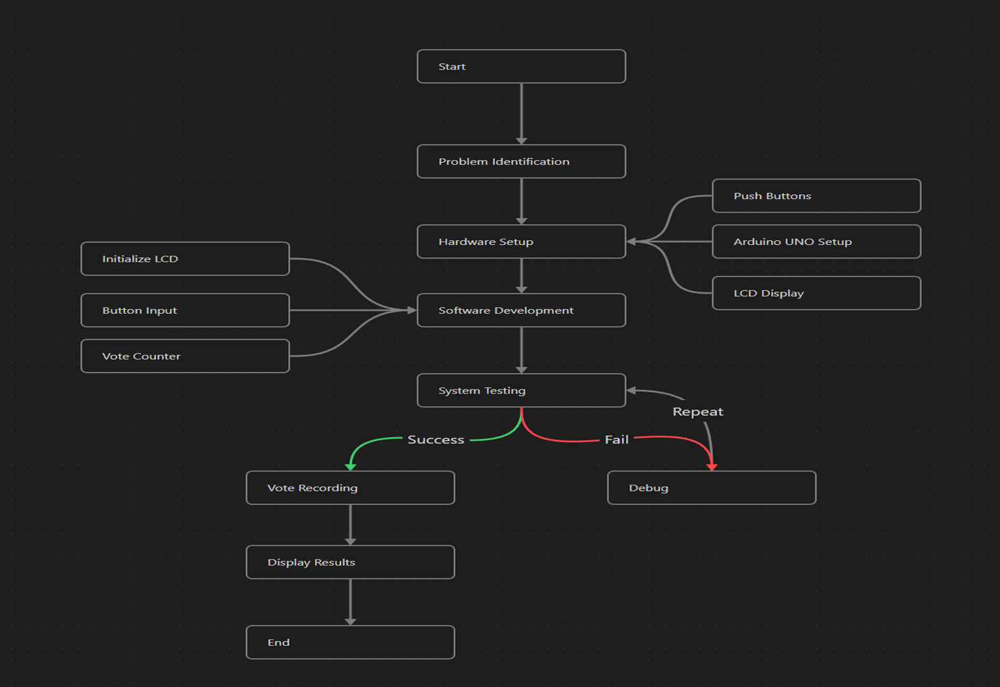

# Electronic-Voting-Machine
A secure and efficient Electronic Voting Machine (EVM) prototype, developed using Arduino Uno, LCDs, and buttons. Includes project report, diagrams, and code.
## Overview:
This project simulates a secure and user-friendly electronic voting system. Developed using Arduino, it features real-time vote counting, result display on an LCD, and tamper-resistant mechanisms.

## Features:
- Real-time vote counting for up to four categories.
- Dynamic result display on an LCD.
- Visual feedback using LEDs.
- Cost-effective design for small-scale elections.

## Technologies Used:
- Arduino
- C++
- LiquidCrystal_I2C library

## Setup Instructions:
1. Connect Arduino Uno to the circuit as per the circuit diagram.
2. Upload the code (`src/EVM_Code.ino`) using the Arduino IDE.
3. Ensure all buttons and LEDs are functioning before running tests.

## Hardware Setup

---
## Working Process Flow Chart 

---

## Future Work:
- Integration of biometric authentication.
- Blockchain-based vote storage for scalability.

## Workflow

### 1. Problem Identification
- **Define Project Goals**:
  - Develop a secure and reliable electronic voting system.
- **Identify Hardware and Software Requirements**:
  - **Hardware**: Push buttons, Arduino UNO, LCD, etc.
  - **Software**: Arduino IDE and necessary libraries.

### 2. Hardware Setup
- **Components to Set Up**:
  - Push buttons for voter input.
  - Arduino UNO for processing votes.
  - LCD display for real-time vote counts and results.
- **Assemble the Circuit**:
  - Wire up the components on a breadboard or PCB as per the circuit design.

### 3. Software Development
- **Write Code**:
  - Initialize hardware components (e.g., LCD, buttons).
  - Create logic for:
    - Button input for voting.
    - Vote counting and storing.
    - Displaying results.
   
### 4. System Testing
- **Test Functionality**:
  - Validate each component individually (e.g., button press, LCD update).
- **Integration Testing**:
  - Ensure smooth interaction between hardware and software.
- **Debugging**:
  - Resolve issues with button debouncing, incorrect vote counts, etc.
- **Repeat Testing**:
  - Iterate until the system performs as expected.

### 5. Vote Recording
- After successful testing, ensure the system:
  - Accepts votes via button presses.
  - Records and counts each vote accurately.
  - Prevents tampering or incorrect inputs.

### 6. Display Results
- Program the LCD to display:
  - Live vote counts during the voting process.
  - Final results after the voting period ends.

### 7. End Process
- Ensure the system terminates safely after recording and displaying results.

## Work FLow Diagram:

---

## Licenses
- [MIT License](LICENSE-MIT)
- [GPL v3 License](LICENSE-GPL)

# Note
## This is a Group Project.   
